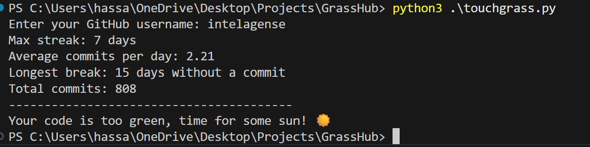

# TouchGrass

## Description

This tool analyzes your contribution graph and playfully reminds you to take a break when your activity gets a little too green. 🌱

## Table of Contents 
- [Description](#description)
- [Installation](#installation)
- [Usage](#usage)
- [Credits](#credits)
- [License](#license)
- [Badges](#badges)
- [Features](#features)
- [How to Contribute](#how-to-contribute)
- [Tests](#tests)

## Installation

1. Git Clone https://github.com/HassanZafar-2021/TouchGrass.git
2. cd GrassHub
3. Generate own classic GitHub token and put in .env file

## Usage

Connect your GitHub account

Enter your GitHub username in the input field.

GrassHub will fetch your contribution graph using the GitHub API.

View your “green level”

The app displays your contribution activity visually.

If you’ve been pushing commits every day, GrassHub will send a friendly reminder to take a break.

## Credits

https://github.com/HassanZafar-2021

## License

No license

## Badges

## Features

📊 Contribution Graph Analysis – Fetches real-time commit activity via CLI.

🌱 Break Reminders – Playful nudges when your graph is too green.

## How to Contribute

1. Fork repo
2. Create your own branch and make changes with a PR request

## Tests

No tests.