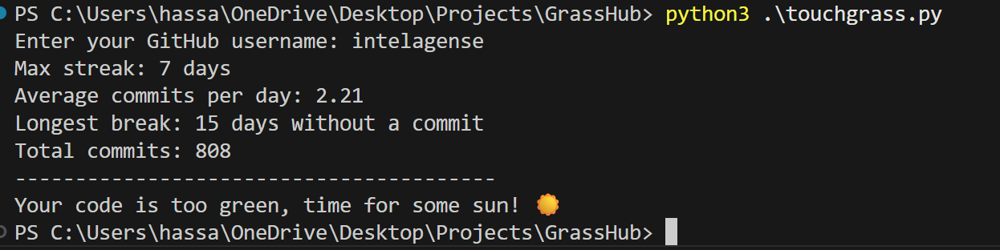

# 🌱 TouchGrass

> Analyzes your GitHub contribution graph and tells you exactly how cooked you are.

---

## Description

TouchGrass pulls your GitHub contribution history and gives you a brutally honest breakdown of your coding habits. Too many commits? It'll tell you to go outside. Not enough? It'll roast you for that too. Built with a Flask backend, vanilla HTML/CSS/JS frontend, and a GitHub GraphQL API integration — featuring a full RPG class system, contribution heatmap, and shareable results.

---

## Table of Contents

- [Description](#description)
- [Installation](#installation)
- [Usage](#usage)
- [Credits](#credits)
- [License](#license)
- [Badges](#badges)
- [Features](#features)
- [How to Contribute](#how-to-contribute)
- [Tests](#tests)

---

## Installation

1. Clone the repository
   ```bash
   git clone https://github.com/HassanZafar-2021/TouchGrass.git
   cd TouchGrass
   ```

2. Install dependencies
   ```bash
   pip install -r requirements.txt
   ```

3. Generate a GitHub Personal Access Token
   - Go to **GitHub → Settings → Developer Settings → Personal Access Tokens → Tokens (classic)**
   - Generate a token with the `read:user` scope
   - Create a `.env` file in the project root:
     ```
     TOKEN=your_token_here
     ```

---

## Usage

### Web App
```bash
python app.py
```
Then open **http://127.0.0.1:5000** in your browser. Enter any GitHub username and hit **Check 'em**.

### CLI
```bash
python touchgrass.py <username>
python touchgrass.py <username> --verbose
```



---

## Credits

Built by [Hassan Zafar](https://github.com/HassanZafar-2021)

---

## License

No license — all rights reserved.

---

## Badges


---

## Features

- 🎮 **RPG Class System** — Get assigned a class based on your habits: Code Lich, Chaos Goblin, Wandering Sage, and more
- 📊 **Contribution Heatmap** — Full year visualized with hover tooltips, matching GitHub's color scale
- 🌱 **Grass Meter** — Visual indicator of how much (or how little) grass you've touched
- 🔗 **Shareable Results** — Copy a link or tweet your class with one click
- 💻 **CLI Support** — Run it straight from the terminal without a browser
- ⚡ **Zero Frontend Dependencies** — Pure HTML, CSS, and JavaScript; no React, no build step

---

## How to Contribute

1. Fork the repository
2. Create a feature branch
   ```bash
   git checkout -b feature/your-feature-name
   ```
3. Commit your changes and open a Pull Request against `main`

---

## Tests

No automated tests currently. Manual testing via the web app at `http://127.0.0.1:5000` and the CLI with `python touchgrass.py <username>`.